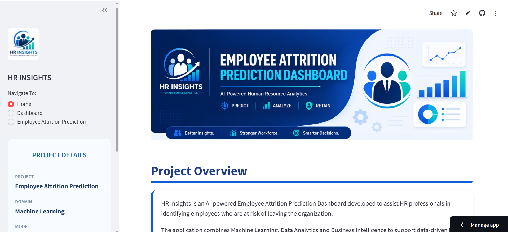
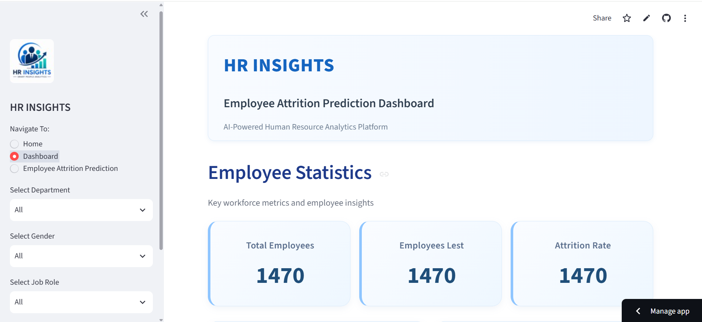
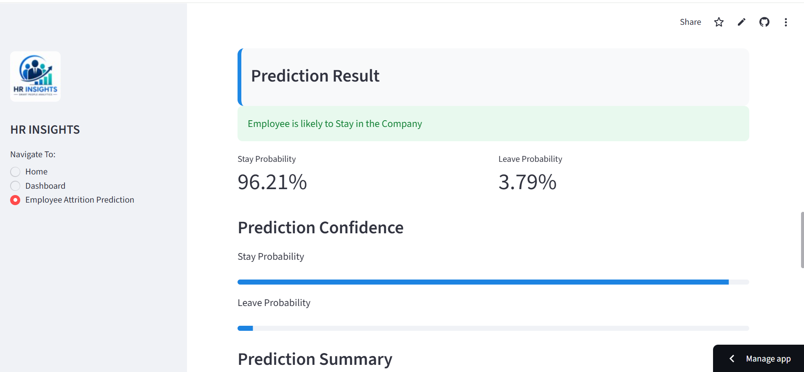
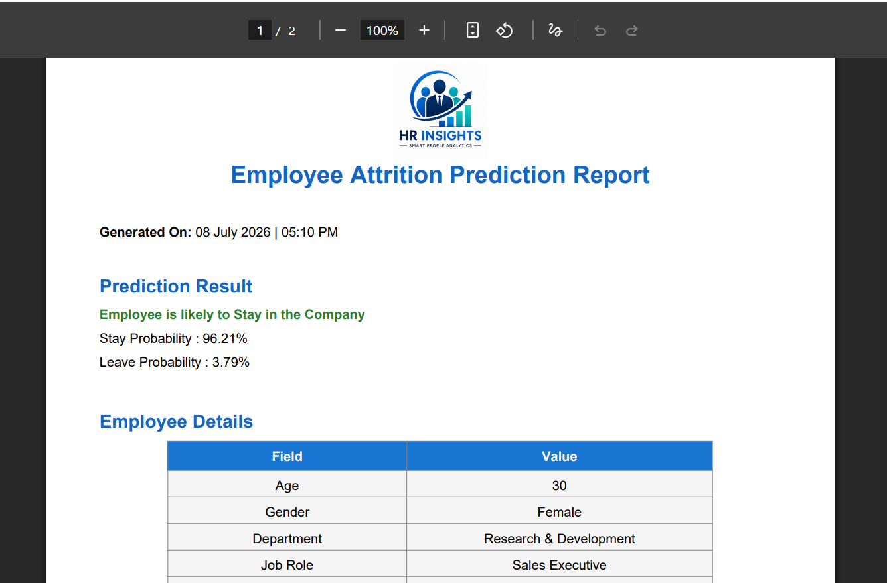

# 📊 HR Insights – AI-Powered Employee Attrition Prediction Dashboard

An AI-powered Human Resource Analytics platform built using **Machine Learning**, **Streamlit**, and **Python** to help HR professionals identify employees who are at risk of leaving the organization.

🔗 **Live Demo:** https://employee-attrition-dashboard-kefrmgwcyx39rtscubbt7p.streamlit.app/

🔗 **GitHub Repository:** https://github.com/Dhanyaraja06/Employee-Attrition-Dashboard

---

# 📌 Project Overview

Employee attrition is one of the major challenges faced by organizations. This project predicts whether an employee is likely to leave the company based on various HR attributes such as age, department, job role, overtime, job satisfaction, monthly income, and more.

The application provides an interactive dashboard, predictive analytics, and downloadable reports to support data-driven HR decision-making.

---

# ✨ Features

- 📈 Interactive HR Analytics Dashboard
- 🤖 Machine Learning-based Attrition Prediction
- 📊 Interactive Plotly Visualizations
- 📄 Downloadable PDF Prediction Reports
- 💾 Prediction History using SQLite Database
- 🎯 Probability Score for Employee Attrition
- 📱 Responsive Streamlit User Interface

---

# 📷 Application Screenshots

## 🏠 Home Page

> Add Home Page Screenshot Here



---

## 📊 Dashboard

> Add Dashboard Screenshot Here



---

## 🤖 Prediction Page

> Add Prediction Screenshot Here



---

## 📄 Generated PDF Report

> Add PDF Screenshot Here



---

# 🧠 Machine Learning Model

Model Used:

- Logistic Regression

Model Performance:

- Accuracy: 88%
- Binary Classification
- Employee Attrition Prediction

---

# 📁 Dataset

IBM HR Analytics Employee Attrition Dataset

Dataset contains employee information including:

- Age
- Department
- Education
- Job Role
- Monthly Income
- Business Travel
- OverTime
- Years at Company
- Job Satisfaction
- Work-Life Balance
- Attrition

---

# 🛠️ Technology Stack

## Programming Language

- Python

## Machine Learning

- Scikit-learn

## Data Analysis

- Pandas
- NumPy

## Visualization

- Plotly

## Web Framework

- Streamlit

## Database

- SQLite

## Report Generation

- ReportLab

## Model Storage

- Joblib

---

# 📂 Project Structure

```
Employee-Attrition-Dashboard/

│
├── assets/
├── app.py
├── database.py
├── report_generator.py
├── train_model.py
├── employee_attrition_model.pkl
├── encoders.pkl
├── employee_dataset.csv
├── prediction_history.db
├── requirements.txt
├── README.md
└── .gitignore
```

---

# 🚀 Installation

Clone the repository

```bash
git clone https://github.com/Dhanyaraja06/Employee-Attrition-Dashboard.git
```

Move into the project folder

```bash
cd Employee-Attrition-Dashboard
```

Install dependencies

```bash
pip install -r requirements.txt
```

Run the application

```bash
streamlit run app.py
```

---

# 📈 Dashboard Insights

The dashboard provides insights including:

- Employee Distribution
- Attrition Rate
- Department-wise Analysis
- Age Group Analysis
- Average Salary by Department
- Overtime vs Attrition
- Education Field Analysis
- Job Role Analysis

---

# 🔮 Future Enhancements

- Deep Learning Model
- Explainable AI (SHAP)
- Employee Retention Recommendations
- Cloud Database Integration
- User Authentication
- Email Report Sharing

---

# 👩‍💻 Developer

**Dhanya R**

Computer Engineering Student

Aspiring Data Analyst | Machine Learning Enthusiast

GitHub:
https://github.com/Dhanyaraja06

LinkedIn:
(Add your LinkedIn Profile)

---

# ⭐ If you like this project

Give this repository a ⭐ on GitHub!
